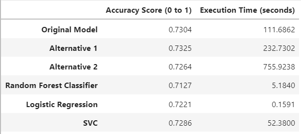

# Module 13 challenge
## Overview

- This analysis is build to compare different style of neural network models and machine learning models.

- Original data has about 34000 rows of data.

[`venture_funding_with_deep_learning.ipynb`](venture_funding_with_deep_learning.ipynb) includes all the analysis.

---
## Summary
The table below is the final result from the analysis.

Details of the neural network models

- Original Model
    - First hidden layer: 58 nodes, `relu` activation function
    - Second hidden layer: 29 nodes, `relu` activation function
- Alternative 1
    - First hidden layer: 58 nodes, `tanh` activation function
    - Second hidden layer: 19 nodes, `tanh` activation function
- Alternative 2
    - First hidden layer: 128 nodes, `relu` activation function
    - Second hidden leyer: 64 nodes, `relu` activation function
    - Third hidden layer: 32 nodes, `sigmoid` activation function
    - Fourth hidden layer: 16 nodes, ` sigmoid` activation function

---
## Conclusion
Overall, `Alternative 1` had the best performance in accuracy score.

However, with this or similar dataset, I would use `Logistic Regression` since the accuracy score is only 0.01 below the `Alternative 1` while the execution time is more than 1500 times faster.

Also, `Alternative 2` has a sign of overfit because the accuracy score is lower than fewer layer models.

---
## Technology
`Python 3.7` or higher

`time` to measure execution time

`tensorflow.keras` for neural network construction and execution.

`pathlib`, `pandas`, and `sklearn` for data handling, encoding, and machine learning application.
